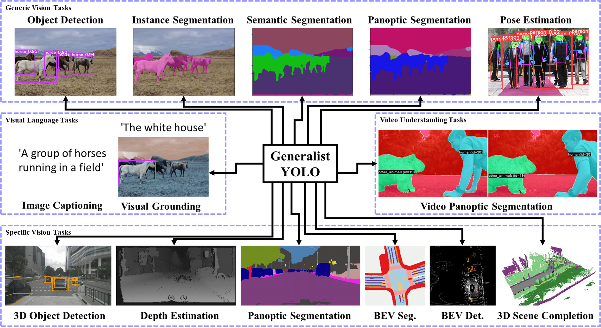

# GeneralistYOLO
Generalist YOLO: Towards Real-Time End-to-End Multi-Task Visual Language Models

<div align="center">
    <a href="./">
        
    </a>
</div>


## Performance

### Generalist Visual Language Tasks

MS COCO

| Model | Size | \#Param. | FLOPs |  AP<sub>e2e/nms</sub><sup>box</sup> | AP<sub>e2e/nms</sub><sup>mask</sup>  | mIoU<sub>164k/10k</sub><sup>semantic</sup>  | mIoU<sup>stuff</sup> | PQ<sup>panoptic</sup> | BLEU@4<sup>caption</sup> | CIDEr<sup>caption</sup> |
| :-- | :-: | :-: | :-: | :-: | :-: | :-: | :-: | :-: | :-: | :-: |
| [**GeneralistYOLO**]() | 640 | 32.5M | \~122.2G | **52.4%/52.8%** | **43.0%/43.1%** | **44.7%/52.0%** | **59.2%** | **44.2%** | **38.7** | **122.1** |
<!--| [****]() |  | M | G | **%/%** | **%/%** | **%/%** | **%** | **%** | **** | **** |-->

## Installation

### Generalist Visual Language Tasks

#### Docker environment (recommended)

<details><summary> <b>expand</b> </summary>

```
# create the docker container, you can change the share memory size if you have more.
nvidia-docker run --name gyolo -it -v your_coco_path/:/coco/ -v your_code_path/:/gyolo --shm-size=64g nvcr.io/nvidia/pytorch:21.11-py3

```

</details>

#### Data preparation

<details><summary> <b>expand</b> </summary>

#### Dataset

We use [MS COCO Dataset](https://cocodataset.org/#download).\
Please download the following files:
  * Images
    * 2017 Train images
    * 2017 Val images
  * Annotations
    * 2017 Train/Val annotations
    * 2017 Stuff Train/Val annotations
    * 2017 Panoptic Train/Val annotations


#### Labels

Download the labels from:
  * [COCO](https://github.com/WongKinYiu/YOLORProject/releases/download/untagged-3d79c649409002041cd4/coco.zip)
  * [Segmentation labels](https://github.com/WongKinYiu/YOLORProject/releases/download/untagged-3d79c649409002041cd4/segmentations.zip)
<!--Change link of official site-->
Extract these zip files and put the data of **`Segmentation labels`** into **`coco/segmentations`** folder.


#### Modify Yaml File

Modify path of **`data/coco.yaml`** to use the dataset:
```
path: path_to_coco_dir
train: train2017.txt
val: val2017.txt
```

#### Dataset Folder Hierarchy

The folder hierarchy should be:
```
coco/
├─ annotations/
│   ├─ captions_train2017.json
│   ├─ captions_val2017.json
│   ├─ instances_train2017.json
│   ├─ instances_val2017.json
│   ├─ panoptic_train2017.json
│   ├─ panoptic_val2017.json
│   ├─ stuff_train2017.json
│   └─ stuff_val2017.json
├─ images/
│   ├─ train2017/
│   │   └─ *.jpg
│   └─ val2017/
│       └─ *.jpg
├─ labels/
│   ├─ train2017/
│   │   └─ *.txt
│   └─ val2017/
│       └─ *.txt
├─ panoptic/
│   └─ masks/
│       ├─ train2017/
│       │   └─ *.png
│       └─ val2017/
│           └─ *.
├─ segmentations/
│   ├─ train2017/
│   │   └─ *.txt
│   └─ val2017/
│       └─ *.txt
├─ train2017.txt
└─ val2017.txt
```

#### (Optional) Data Preprocess
**Note: This command is used to generate the labels of semantic segmantation.**
**If you already download the `Segmentation labels` above, you can skip this process.**

Use the following command to merge instance and stuff to semantic segmentation:
```
python preprocess.py --data coco.yaml
```
You can also add **`--export-train`** and **`--export-val`** to export the semantic masks of train and val sets.

</details>

## Evaluation

### Generalist Visual Language Tasks

```
python caption/val.py --data coco.yaml --batch 4 --weights 'gyolo.pt' --img 640 --conf 0.001 --iou 0.7 --device 0 --save-json --export-mask
```

<details><summary> <b>End-to-End Performance</b> </summary>

Object Detection

```
 Average Precision  (AP) @[ IoU=0.50:0.95 | area=   all | maxDets=100 ] = 0.524
 Average Precision  (AP) @[ IoU=0.50      | area=   all | maxDets=100 ] = 0.700
 Average Precision  (AP) @[ IoU=0.75      | area=   all | maxDets=100 ] = 0.569
 Average Precision  (AP) @[ IoU=0.50:0.95 | area= small | maxDets=100 ] = 0.343
 Average Precision  (AP) @[ IoU=0.50:0.95 | area=medium | maxDets=100 ] = 0.580
 Average Precision  (AP) @[ IoU=0.50:0.95 | area= large | maxDets=100 ] = 0.680
 Average Recall     (AR) @[ IoU=0.50:0.95 | area=   all | maxDets=  1 ] = 0.388
 Average Recall     (AR) @[ IoU=0.50:0.95 | area=   all | maxDets= 10 ] = 0.646
 Average Recall     (AR) @[ IoU=0.50:0.95 | area=   all | maxDets=100 ] = 0.695
 Average Recall     (AR) @[ IoU=0.50:0.95 | area= small | maxDets=100 ] = 0.529
 Average Recall     (AR) @[ IoU=0.50:0.95 | area=medium | maxDets=100 ] = 0.754
 Average Recall     (AR) @[ IoU=0.50:0.95 | area= large | maxDets=100 ] = 0.843
```

Instance Segmentation

```
 Average Precision  (AP) @[ IoU=0.50:0.95 | area=   all | maxDets=100 ] = 0.430
 Average Precision  (AP) @[ IoU=0.50      | area=   all | maxDets=100 ] = 0.669
 Average Precision  (AP) @[ IoU=0.75      | area=   all | maxDets=100 ] = 0.457
 Average Precision  (AP) @[ IoU=0.50:0.95 | area= small | maxDets=100 ] = 0.232
 Average Precision  (AP) @[ IoU=0.50:0.95 | area=medium | maxDets=100 ] = 0.480
 Average Precision  (AP) @[ IoU=0.50:0.95 | area= large | maxDets=100 ] = 0.611
 Average Recall     (AR) @[ IoU=0.50:0.95 | area=   all | maxDets=  1 ] = 0.337
 Average Recall     (AR) @[ IoU=0.50:0.95 | area=   all | maxDets= 10 ] = 0.538
 Average Recall     (AR) @[ IoU=0.50:0.95 | area=   all | maxDets=100 ] = 0.571
 Average Recall     (AR) @[ IoU=0.50:0.95 | area= small | maxDets=100 ] = 0.365
 Average Recall     (AR) @[ IoU=0.50:0.95 | area=medium | maxDets=100 ] = 0.633
 Average Recall     (AR) @[ IoU=0.50:0.95 | area= large | maxDets=100 ] = 0.766
```

Sementic Segmentation (164k)

```
+------------------+-------+-------+
|      Class       |  IoU  |  Acc  |
+------------------+-------+-------+
|    unlabeled     |  nan  |  nan  |
|      person      | 84.86 | 93.16 |
|     bicycle      | 70.03 |  85.5 |
|       car        | 64.03 | 80.68 |
|    motorcycle    | 82.11 | 92.03 |
|     airplane     | 83.58 | 95.03 |
|       bus        | 83.89 | 88.31 |
|      train       | 85.93 | 95.77 |
|      truck       | 58.29 | 77.87 |
|       boat       | 60.76 | 80.73 |
|  traffic light   | 72.42 | 88.09 |
|   fire hydrant   | 87.81 | 96.83 |
|    stop sign     | 88.85 | 98.47 |
|  parking meter   | 71.55 |  79.2 |
|      bench       | 48.87 | 72.44 |
|       bird       | 70.25 | 80.34 |
|       cat        | 85.84 | 94.42 |
|       dog        | 77.41 | 86.99 |
|      horse       | 82.46 |  96.0 |
|      sheep       | 86.14 | 95.76 |
|       cow        | 84.38 | 91.59 |
|     elephant     | 90.21 | 97.53 |
|       bear       | 89.74 | 94.42 |
|      zebra       | 88.84 | 95.87 |
|     giraffe      | 86.82 | 95.68 |
|     backpack     | 29.63 | 53.67 |
|     umbrella     | 74.51 | 87.73 |
|     handbag      | 26.91 | 46.98 |
|       tie        |  1.52 |  7.45 |
|     suitcase     | 72.03 | 88.68 |
|     frisbee      | 33.48 | 88.33 |
|       skis       | 48.53 | 63.79 |
|    snowboard     |  54.1 | 62.81 |
|   sports ball    | 61.87 | 74.01 |
|       kite       | 54.46 | 71.27 |
|   baseball bat   | 44.28 | 63.32 |
|  baseball glove  | 45.31 | 75.14 |
|    skateboard    | 59.39 | 69.72 |
|    surfboard     | 69.36 | 82.31 |
|  tennis racket   |  77.2 | 94.05 |
|      bottle      | 60.69 | 76.84 |
|    wine glass    | 71.92 | 83.25 |
|       cup        | 56.67 | 78.08 |
|       fork       | 50.22 | 59.83 |
|      knife       | 36.22 | 45.91 |
|      spoon       | 38.49 | 48.59 |
|       bowl       | 52.75 | 64.88 |
|      banana      | 74.19 | 90.02 |
|      apple       | 46.75 | 66.49 |
|     sandwich     | 52.52 | 73.81 |
|      orange      | 62.68 | 90.65 |
|     broccoli     | 47.92 | 69.18 |
|      carrot      | 55.95 | 72.26 |
|     hot dog      | 62.78 | 71.53 |
|      pizza       | 80.19 | 90.89 |
|      donut       | 62.88 |  81.4 |
|       cake       | 63.41 | 80.72 |
|      chair       | 48.88 | 70.26 |
|      couch       | 52.75 | 81.58 |
|   potted plant   |  32.8 | 52.98 |
|       bed        | 62.34 | 80.18 |
|   dining table   | 46.45 | 77.74 |
|      toilet      | 80.01 | 93.89 |
|        tv        | 70.21 |  85.8 |
|      laptop      | 76.01 | 92.74 |
|      mouse       | 71.09 | 90.58 |
|      remote      | 41.18 | 74.18 |
|     keyboard     |  76.8 | 86.66 |
|    cell phone    | 69.47 | 88.76 |
|    microwave     | 71.89 | 80.98 |
|       oven       | 57.07 |  85.7 |
|     toaster      | 16.02 | 19.88 |
|       sink       | 54.85 | 81.12 |
|   refrigerator   | 72.63 | 91.97 |
|       book       | 43.71 | 67.28 |
|      clock       | 66.02 | 81.57 |
|       vase       | 57.18 | 81.76 |
|     scissors     | 57.41 | 68.47 |
|    teddy bear    | 75.06 | 94.48 |
|    hair drier    |  12.1 |  13.0 |
|    toothbrush    | 42.57 |  82.4 |
|      banner      | 28.75 |  64.1 |
|     blanket      |  4.71 |  4.9  |
|      branch      | 17.54 | 19.07 |
|      bridge      | 29.11 | 41.19 |
|  building-other  | 53.07 | 71.46 |
|       bush       | 28.35 | 35.92 |
|     cabinet      | 53.94 | 73.32 |
|       cage       | 22.65 | 37.39 |
|    cardboard     | 38.95 |  52.3 |
|      carpet      | 48.63 | 70.33 |
|  ceiling-other   | 59.97 | 83.41 |
|   ceiling-tile   |  0.0  |  0.0  |
|      cloth       |  0.0  |  0.0  |
|     clothes      | 15.54 | 19.18 |
|      clouds      | 51.44 | 70.78 |
|     counter      | 27.17 | 49.03 |
|     cupboard     |  0.0  |  0.0  |
|     curtain      | 61.09 | 75.68 |
|    desk-stuff    | 41.19 | 58.88 |
|       dirt       | 39.18 |  63.3 |
|    door-stuff    | 34.88 |  58.0 |
|      fence       | 32.11 | 55.61 |
|   floor-marble   |  0.0  |  0.0  |
|   floor-other    | 20.38 | 28.56 |
|   floor-stone    |  1.22 |  1.45 |
|    floor-tile    | 59.88 | 73.49 |
|    floor-wood    | 56.31 | 76.05 |
|      flower      | 41.24 | 63.94 |
|       fog        |  5.29 |  5.53 |
|    food-other    | 23.03 | 29.74 |
|      fruit       | 23.25 | 33.46 |
| furniture-other  | 11.95 | 14.54 |
|      grass       | 67.63 |  84.0 |
|      gravel      | 24.22 | 33.02 |
|   ground-other   |  0.01 |  0.01 |
|       hill       | 11.37 | 14.06 |
|      house       | 24.15 | 28.92 |
|      leaves      | 19.67 | 23.16 |
|      light       | 33.13 | 43.04 |
|       mat        |  0.0  |  0.0  |
|      metal       | 25.95 | 35.11 |
|   mirror-stuff   |  46.3 | 59.93 |
|       moss       |  0.0  |  0.0  |
|     mountain     | 51.84 | 69.33 |
|       mud        |  0.0  |  0.0  |
|      napkin      |  0.0  |  0.0  |
|       net        | 38.73 | 56.65 |
|      paper       | 26.97 | 37.97 |
|     pavement     | 47.96 |  65.6 |
|      pillow      |  0.04 |  0.04 |
|   plant-other    | 11.92 | 17.66 |
|     plastic      |  8.67 | 10.36 |
|     platform     | 26.13 |  43.2 |
|   playingfield   | 67.44 | 85.82 |
|     railing      |  0.0  |  0.0  |
|     railroad     | 58.88 | 80.49 |
|      river       | 47.47 | 73.29 |
|       road       | 63.05 | 85.34 |
|       rock       |  49.4 | 78.22 |
|       roof       | 13.73 | 16.23 |
|       rug        | 31.78 | 47.12 |
|      salad       |  0.0  |  0.0  |
|       sand       |  59.8 | 66.58 |
|       sea        | 84.48 | 93.09 |
|      shelf       | 28.05 | 44.77 |
|    sky-other     | 71.52 | 85.74 |
|    skyscraper    | 34.83 | 45.86 |
|       snow       | 87.85 | 94.18 |
|   solid-other    |  0.0  |  0.0  |
|      stairs      | 18.45 | 34.88 |
|      stone       |  0.04 |  0.04 |
|      straw       | 25.23 | 35.38 |
| structural-other |  0.0  |  0.0  |
|      table       | 21.97 | 32.77 |
|       tent       |  7.99 | 10.02 |
|  textile-other   | 11.05 | 16.53 |
|      towel       | 26.33 | 34.97 |
|       tree       | 71.69 | 89.39 |
|    vegetable     | 29.58 | 39.57 |
|    wall-brick    | 44.48 |  65.1 |
|  wall-concrete   | 56.56 | 77.85 |
|    wall-other    | 17.42 | 26.48 |
|    wall-panel    |  0.0  |  0.0  |
|    wall-stone    | 28.92 |  35.3 |
|    wall-tile     | 62.57 |  81.9 |
|    wall-wood     | 36.82 | 52.74 |
|   water-other    | 24.21 | 32.21 |
|    waterdrops    |  0.0  |  0.0  |
|   window-blind   | 43.78 | 55.65 |
|   window-other   | 41.27 | 68.13 |
|       wood       | 14.98 | 20.71 |
|      other       |  nan  |  nan  |
+------------------+-------+-------+
mIoU: 44.71
```

Sementic Segmentation (10k)

```
+------------------+-------+-------+
|      Class       |  IoU  |  Acc  |
+------------------+-------+-------+
|    unlabeled     |  0.0  |  0.0  |
|      person      | 89.51 | 93.95 |
|     bicycle      | 80.23 | 94.89 |
|       car        | 77.79 | 91.13 |
|    motorcycle    | 91.53 | 96.09 |
|     airplane     | 91.56 | 96.86 |
|       bus        | 78.32 | 82.81 |
|      train       | 84.03 | 97.35 |
|      truck       | 81.86 | 91.39 |
|       boat       | 82.03 |  91.1 |
|  traffic light   | 83.19 | 92.57 |
|   fire hydrant   | 94.32 | 97.83 |
|    stop sign     |  96.3 |  98.8 |
|  parking meter   | 93.45 | 98.75 |
|      bench       |  63.4 | 73.69 |
|       bird       | 78.83 | 83.16 |
|       cat        | 92.11 |  96.2 |
|       dog        | 90.22 | 96.16 |
|      horse       | 91.82 | 96.67 |
|      sheep       | 84.12 | 88.55 |
|       cow        | 95.46 |  98.8 |
|     elephant     | 91.32 | 97.54 |
|       bear       | 94.91 | 98.01 |
|      zebra       | 91.93 | 96.91 |
|     giraffe      | 88.71 | 95.79 |
|     backpack     | 26.41 | 64.16 |
|     umbrella     | 74.86 | 82.87 |
|     handbag      | 19.46 | 28.59 |
|       tie        | 56.53 | 87.15 |
|     suitcase     |  78.7 | 96.52 |
|     frisbee      | 94.25 | 98.44 |
|       skis       | 53.84 | 71.81 |
|    snowboard     |  78.0 | 89.26 |
|   sports ball    | 80.14 | 92.07 |
|       kite       | 82.64 | 90.41 |
|   baseball bat   | 61.12 |  88.1 |
|  baseball glove  | 87.25 | 96.25 |
|    skateboard    | 71.44 | 92.04 |
|    surfboard     | 92.07 | 95.83 |
|  tennis racket   | 86.32 | 98.22 |
|      bottle      | 62.63 | 67.93 |
|    wine glass    | 83.16 | 94.68 |
|       cup        | 74.92 | 84.94 |
|       fork       | 42.35 | 61.53 |
|      knife       | 75.21 | 79.47 |
|      spoon       | 53.88 | 59.72 |
|       bowl       | 65.96 |  70.1 |
|      banana      | 84.71 | 94.33 |
|      apple       | 73.57 | 84.38 |
|     sandwich     | 87.26 | 88.74 |
|      orange      | 68.71 | 91.81 |
|     broccoli     | 87.19 | 94.84 |
|      carrot      | 73.76 | 84.37 |
|     hot dog      | 48.05 | 96.32 |
|      pizza       | 93.58 | 95.03 |
|      donut       | 62.73 | 73.17 |
|       cake       | 91.87 | 93.91 |
|      chair       |  66.2 | 87.91 |
|      couch       | 77.24 | 95.24 |
|   potted plant   | 45.71 | 56.18 |
|       bed        | 81.64 | 92.91 |
|   dining table   | 66.72 | 88.02 |
|      toilet      | 92.97 | 97.25 |
|        tv        | 78.62 | 96.39 |
|      laptop      | 88.94 | 97.86 |
|      mouse       | 75.67 | 79.79 |
|      remote      | 51.58 | 62.81 |
|     keyboard     | 90.94 | 95.07 |
|    cell phone    | 84.11 | 97.22 |
|    microwave     | 41.51 | 76.53 |
|       oven       | 73.16 | 88.12 |
|     toaster      | 19.62 | 19.62 |
|       sink       | 84.92 | 89.03 |
|   refrigerator   | 87.58 | 97.52 |
|       book       | 77.65 | 90.83 |
|      clock       | 74.15 | 92.76 |
|       vase       | 68.39 | 96.87 |
|     scissors     | 82.61 | 96.54 |
|    teddy bear    | 87.25 | 98.11 |
|    hair drier    |  0.94 |  0.94 |
|    toothbrush    | 25.65 |  30.9 |
|      banner      | 40.85 |  63.5 |
|     blanket      |  0.0  |  0.0  |
|      branch      |  0.0  |  0.0  |
|      bridge      |  8.37 | 10.71 |
|  building-other  | 61.54 | 80.41 |
|       bush       | 27.83 | 30.96 |
|     cabinet      | 21.48 | 79.41 |
|       cage       |  0.0  |  0.0  |
|    cardboard     | 13.07 | 23.45 |
|      carpet      | 64.81 | 86.65 |
|  ceiling-other   | 64.85 | 86.37 |
|   ceiling-tile   |  0.0  |  0.0  |
|      cloth       |  0.0  |  0.0  |
|     clothes      | 33.63 | 45.14 |
|      clouds      | 40.58 | 45.55 |
|     counter      | 52.43 | 59.55 |
|     cupboard     |  0.0  |  0.0  |
|     curtain      | 66.88 |  81.6 |
|    desk-stuff    | 37.35 | 49.24 |
|       dirt       | 36.32 | 70.93 |
|    door-stuff    | 49.48 | 68.39 |
|      fence       | 41.34 | 57.21 |
|   floor-marble   |  0.0  |  0.0  |
|   floor-other    | 35.03 | 58.93 |
|   floor-stone    | 14.11 | 21.97 |
|    floor-tile    | 61.11 | 73.52 |
|    floor-wood    | 66.94 | 85.74 |
|      flower      | 20.39 | 54.75 |
|       fog        |  0.0  |  0.0  |
|    food-other    | 30.71 | 43.36 |
|      fruit       |  65.3 | 84.93 |
| furniture-other  | 17.89 | 20.81 |
|      grass       | 75.38 | 89.23 |
|      gravel      | 29.83 | 35.46 |
|   ground-other   |  0.0  |  0.0  |
|       hill       | 26.77 | 29.34 |
|      house       | 41.49 | 52.24 |
|      leaves      | 46.16 | 59.14 |
|      light       | 34.34 |  43.4 |
|       mat        |  0.0  |  0.0  |
|      metal       | 12.79 | 30.98 |
|   mirror-stuff   | 53.17 | 62.22 |
|       moss       |  0.0  |  0.0  |
|     mountain     | 36.63 | 91.39 |
|       mud        |  0.0  |  0.0  |
|      napkin      |  0.0  |  0.0  |
|       net        | 52.53 | 57.16 |
|      paper       | 29.87 | 56.91 |
|     pavement     | 48.03 | 85.76 |
|      pillow      |  0.0  |  0.0  |
|   plant-other    | 27.87 | 30.27 |
|     plastic      | 16.85 | 25.25 |
|     platform     | 49.37 | 55.79 |
|   playingfield   | 60.95 | 69.98 |
|     railing      |  0.05 |  0.05 |
|     railroad     | 56.27 | 89.34 |
|      river       | 47.54 | 92.76 |
|       road       | 76.87 | 86.12 |
|       rock       | 57.34 | 81.09 |
|       roof       | 25.76 | 34.79 |
|       rug        | 58.84 | 68.68 |
|      salad       |  0.0  |  0.0  |
|       sand       | 63.62 | 79.03 |
|       sea        | 75.81 | 93.63 |
|      shelf       | 18.32 | 44.97 |
|    sky-other     | 62.14 |  88.1 |
|    skyscraper    | 57.28 | 68.92 |
|       snow       | 88.33 | 94.69 |
|   solid-other    |  0.0  |  0.0  |
|      stairs      | 46.39 | 67.51 |
|      stone       |  0.0  |  0.0  |
|      straw       | 15.59 | 33.19 |
| structural-other |  0.0  |  0.0  |
|      table       | 20.29 |  33.7 |
|       tent       | 65.86 | 82.32 |
|  textile-other   |  17.8 | 25.05 |
|      towel       | 40.82 | 42.54 |
|       tree       | 78.66 |  93.6 |
|    vegetable     |  47.9 | 68.54 |
|    wall-brick    | 52.22 | 68.49 |
|  wall-concrete   |  7.76 | 84.44 |
|    wall-other    | 10.07 | 10.59 |
|    wall-panel    |  0.0  |  0.0  |
|    wall-stone    | 40.65 |  49.9 |
|    wall-tile     | 61.45 | 94.53 |
|    wall-wood     | 41.37 | 63.97 |
|   water-other    | 14.65 | 14.94 |
|    waterdrops    |  0.0  |  0.0  |
|   window-blind   | 34.87 |  71.5 |
|   window-other   | 48.62 | 62.69 |
|       wood       | 12.66 | 21.92 |
+------------------+-------+-------+
{'aAcc': 73.17, 'mIoU': 52.0, 'mAcc': 64.1}
```

Stuff Segmentation

```
 Mean IOU       @[ classes=  leaves ] = 0.3007
 FW IOU         @[ classes=  leaves ] = 0.5923
 Mean accuracy  @[ classes=  leaves ] = 0.4080
 Pixel accuracy @[ classes=  leaves ] = 0.7328
 Mean IOU       @[ classes=supercats ] = 0.5855
 FW IOU         @[ classes=supercats ] = 0.7167
 Mean accuracy  @[ classes=supercats ] = 0.7039
 Pixel accuracy @[ classes=supercats ] = 0.8304
 class | class name           |  iou   |  macc
 92    | banner               | 0.2896 | 0.6410
 93    | blanket              | 0.0471 | 0.0490
 94    | branch               | 0.1754 | 0.1907
 95    | bridge               | 0.2911 | 0.4119
 96    | building-other       | 0.5348 | 0.7146
 97    | bush                 | 0.2836 | 0.3592
 98    | cabinet              | 0.5399 | 0.7332
 99    | cage                 | 0.2267 | 0.3739
 100   | cardboard            | 0.3905 | 0.5230
 101   | carpet               | 0.4863 | 0.7033
 102   | ceiling-other        | 0.6000 | 0.8341
 103   | ceiling-tile         | 0.0000 | 0.0000
 104   | cloth                | 0.0000 | 0.0000
 105   | clothes              | 0.1589 | 0.1918
 106   | clouds               | 0.5148 | 0.7078
 107   | counter              | 0.2717 | 0.4903
 108   | cupboard             | 0.0000 | 0.0000
 109   | curtain              | 0.6111 | 0.7568
 110   | desk-stuff           | 0.4120 | 0.5888
 111   | dirt                 | 0.3920 | 0.6330
 112   | door-stuff           | 0.3492 | 0.5800
 113   | fence                | 0.3232 | 0.5561
 114   | floor-marble         | 0.0000 | 0.0000
 115   | floor-other          | 0.2041 | 0.2856
 116   | floor-stone          | 0.0122 | 0.0145
 117   | floor-tile           | 0.5990 | 0.7349
 118   | floor-wood           | 0.5633 | 0.7605
 119   | flower               | 0.4130 | 0.6394
 120   | fog                  | 0.0529 | 0.0553
 121   | food-other           | 0.2344 | 0.2974
 122   | fruit                | 0.2396 | 0.3346
 123   | furniture-other      | 0.1198 | 0.1454
 124   | grass                | 0.6778 | 0.8400
 125   | gravel               | 0.2422 | 0.3302
 126   | ground-other         | 0.0001 | 0.0001
 127   | hill                 | 0.1138 | 0.1406
 128   | house                | 0.2418 | 0.2892
 129   | leaves               | 0.1968 | 0.2316
 130   | light                | 0.3313 | 0.4304
 131   | mat                  | 0.0000 | 0.0000
 132   | metal                | 0.2600 | 0.3511
 133   | mirror-stuff         | 0.4630 | 0.5993
 134   | moss                 | 0.0000 | 0.0000
 135   | mountain             | 0.5194 | 0.6933
 136   | mud                  | 0.0000 | 0.0000
 137   | napkin               | 0.0000 | 0.0000
 138   | net                  | 0.3873 | 0.5665
 139   | paper                | 0.2706 | 0.3797
 140   | pavement             | 0.4802 | 0.6560
 141   | pillow               | 0.0004 | 0.0004
 142   | plant-other          | 0.1192 | 0.1766
 143   | plastic              | 0.0867 | 0.1036
 144   | platform             | 0.2613 | 0.4320
 145   | playingfield         | 0.6762 | 0.8582
 146   | railing              | 0.0000 | 0.0000
 147   | railroad             | 0.5888 | 0.8049
 148   | river                | 0.4772 | 0.7329
 149   | road                 | 0.6336 | 0.8534
 150   | rock                 | 0.4942 | 0.7822
 151   | roof                 | 0.1374 | 0.1623
 152   | rug                  | 0.3178 | 0.4712
 153   | salad                | 0.0000 | 0.0000
 154   | sand                 | 0.5991 | 0.6658
 155   | sea                  | 0.8463 | 0.9309
 156   | shelf                | 0.2912 | 0.4477
 157   | sky-other            | 0.7164 | 0.8574
 158   | skyscraper           | 0.3484 | 0.4586
 159   | snow                 | 0.8814 | 0.9418
 160   | solid-other          | 0.0000 | 0.0000
 161   | stairs               | 0.1998 | 0.3488
 162   | stone                | 0.0004 | 0.0004
 163   | straw                | 0.2523 | 0.3538
 164   | structural-other     | 0.0000 | 0.0000
 165   | table                | 0.2199 | 0.3277
 166   | tent                 | 0.0801 | 0.1002
 167   | textile-other        | 0.1107 | 0.1653
 168   | towel                | 0.2633 | 0.3497
 169   | tree                 | 0.7186 | 0.8939
 170   | vegetable            | 0.2972 | 0.3957
 171   | wall-brick           | 0.4457 | 0.6510
 172   | wall-concrete        | 0.5664 | 0.7785
 173   | wall-other           | 0.1750 | 0.2648
 174   | wall-panel           | 0.0000 | 0.0000
 175   | wall-stone           | 0.2892 | 0.3530
 176   | wall-tile            | 0.6257 | 0.8190
 177   | wall-wood            | 0.3684 | 0.5274
 178   | water-other          | 0.2423 | 0.3221
 179   | waterdrops           | 0.0000 | 0.0000
 180   | window-blind         | 0.4380 | 0.5565
 181   | window-other         | 0.4135 | 0.6813
 182   | wood                 | 0.1498 | 0.2071
 183   | other                | 0.8158 | 0.9459
```

Panoptic Segmentation

```
          |    PQ     SQ     RQ     N
--------------------------------------
All       |  44.2   81.3   52.8   133
Things    |  53.0   83.8   62.6    80
Stuff     |  30.9   77.4   38.1    53
```

Image Captioning

```
Bleu_1: 0.783
Bleu_2: 0.638
Bleu_3: 0.500
Bleu_4: 0.387
METEOR: 0.279
ROUGE_L: 0.584
CIDEr: 1.221
SPICE: 0.216
```

</details>

<details><summary> <b>Eval COCO-Stuff 10K</b> </summary>

Download the evaluation code from:
  * [eval_10k](https://github.com/WongKinYiu/YOLORProject/releases/download/untagged-b4fdc6beee847a92a379/eval_10k.zip)
<!--Change link of official site-->
Extract the zip file and put the **`eval_10k`** folder into **`Project Root`** folder.
The folder hierarchy should be:
```
/
├─ data/
├─ model/
├─ utils/
├─ eval_10k/
│   ├─ test_stuff_10k/
│   │   └─ *.jpg
│   ├─ cocostuff-10k-v1.1.json
│   ├─ eval_stuff_10k.py
│   ├─ predict_10k.py
│   └─ test_stuff_10k.txt
etc.
```

Files in this zip:
  * test_stuff_10k folder: stuff 10k test set (1k images)
  * cocostuff-10k-v1.1.json: ground truth file of stuff 10k
  * eval_stuff_10k.py: evaluation code for stuff 10k
  * predict_10k.py: generate the json file of predictions
  * test_stuff_10k.txt: file list of stuff 10k test set

Usage:
  1. Use the following command to create prediction file:
  ```
  python eval_10k/predict_10k.py --weights /path/to/weights.pt --source eval_10k/test_stuff_10k --data /path/to/coco.yaml --img 640 --device 0 --export-mask --color-map /path/to/color_map.pickle
  ```
  The prediction file **`predictions_semantic.json`** will be created under the predict result folder (default: **`runs/predict-sem/exp{n}/`**)

  2. Then, use the following command for evaluation:
  ```
  python eval_stuff_10k.py --gt eval_10k/cocostuff-10k-v1.1.json --pred /path/to/predictions_semantic.json
  ```
</details>

## Training

### Generalist Visual Language Tasks

```
python -m torch.distributed.launch --nproc_per_node 8 --master_port 9527 caption/train.py --data coco.yaml --epochs 60 --batch 64 --img 640 --cfg models/caption/gyolo.yaml --name gyolo --weights '' --hyp data/hyps/hyp.cap.scratch.yaml --device 0,1,2,3,4,5,6,7 --optimizer AdamW --flat-cos-lr --no-overlap --close-mosaic 2 --save-period 1 --noval --noplots
```
**Cider Optimization for Improving Image Captioning:**
```
python -m torch.distributed.launch --nproc_per_node 8 --master_port 9527 caption/tune.py --weights 'gyolo.pt' --cfg models/caption/gyolo.yaml --name gyolo-co --data data/coco.yaml --hyp data/hyps/hyp.scratch-cap.yaml --epochs 10 --batch-size 64 --img 640 --device 0,1,2,3,4,5,6,7 --optimizer AdamW --save-period 1
```
<!--謝謝你，9527。-->

## Citation

```
@inproceedings{wang2024yolov9,
  title={{Generalist YOLO}: Towards Real-Time End-to-End Multi-Task Visual Language Models},
  author={Chang, Hung-Shuo and Wang, Chien-Yao and Wang, Richard and Chou, Gene and Liao, Hong-Yuan Mark},
  booktitle={IEEE/CVF Winter Conference on Applications of Computer Vision (WACV)},
  year={2025}
}
```

## Coming Soon

<details><summary> <b>Coming soon</b> </summary>

* Visual Grounding
* Whole Body Pose Estimation
* Video Understanding Tasks
* Specific Vision Tasks

</details>

## Contributors

<details><summary> <b>Contributors</b> </summary>

* @ws6125 : Most of generic vision tasks and visual language tasks.
* @110598074 : Most of specific vision tasks.
* @F84064014 : Video panoptic segmentation.
* @k22708038 : Visual grounding.
* @HuChengXue : Whole body pose estimation.
* ...

</details>


## Acknowledgements

<details><summary> <b>Reference Codes</b> </summary>

* [https://github.com/WongKinYiu/yolov9](https://github.com/WongKinYiu/yolov9)
* [https://github.com/davidnvq/grit](https://github.com/davidnvq/grit)
* [https://github.com/djiajunustc/TransVG](https://github.com/djiajunustc/TransVG)
* [https://github.com/Robertwyq/PanoOcc](https://github.com/Robertwyq/PanoOcc)
* [https://github.com/junjiehe96/FastInst](https://github.com/junjiehe96/FastInst)
* [https://github.com/fan23j/yolov7-pose-whole-body](https://github.com/fan23j/yolov7-pose-whole-body)
* ...

</details>
